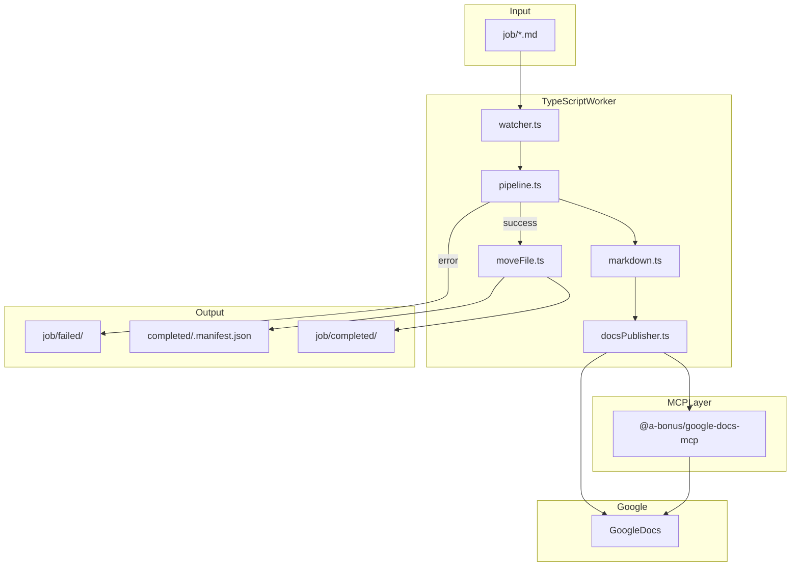

# MD → Google Docs 자동 등록 — 사양서

> 본 문서는 `ex06mdToGoogleDocs` 프로젝트의 기획·아키텍처·구현 기준이다.

---

## 1. 개요

### 1.1 목적

`job/` 폴더의 Markdown 파일을 감지·변환하여 Google Docs에 자동 등록하고, 성공 시 `job/completed/`로 이동한다.

### 1.2 기술 스택

| 항목 | 내용 |
|------|------|
| 언어 | TypeScript (Node.js 18+) |
| MCP Client | `@modelcontextprotocol/sdk` |
| Docs MCP | `@a-bonus/google-docs-mcp` |
| SA Fallback | `googleapis` (Service Account 모드) |
| 파일 감시 | `chokidar` |
| 설정 | `dotenv` |

### 1.3 확정 사항

- Docs MCP: `@a-bonus/google-docs-mcp`
- 인증: OAuth + Service Account (`AUTH_MODE` 전환)
- MCP 구성: `google-sheets` 제거 → `md-to-gdocs-mcp`만 사용

### 1.4 구현 기본값 (미결 항목 임시 확정)

| 항목 | 선택 |
|------|------|
| 문서 생성 정책 | 항상 새 Google Doc 생성 |
| 저장 위치 | `DOCS_FOLDER_ID` 있으면 해당 폴더, 없으면 Drive 루트 |
| 실행 방식 | `npm run once` + `npm run watch` |
| MD 변환 | `replaceDocumentWithMarkdown` (제목·목록·굵게·코드블록) |
| 실패 재시도 | 수동 (`job/`에 다시 넣기) |
| SA fallback | MCP 실패 시 `googleapis` 직접 호출 |
| 문서 제목 | MD 첫 `#` heading, 없으면 파일명 |

---

## 2. MCP 설정

[`.cursor/mcp.json`](../.cursor/mcp.json) — `google-sheets` 제거, `md-to-gdocs-mcp`만 유지:

```json
"google-drive-docs": {
  "command": "C:\\Program Files\\nodejs\\node.exe",
  "args": ["C:\\path\\to\\ex06mdToGoogleDocs\\scripts\\run-google-docs-mcp.mjs"],
  "env": {
    "REPO_ROOT": "C:\\02Workspaces\\99CursorAI",
    "XDG_CONFIG_HOME": "C:\\02Workspaces\\99CursorAI",
    "PYTHONIOENCODING": "utf-8"
  }
}
```

OAuth 클라이언트 시크릿은 `credentials.json`에서 런타임 로드 (Git 미추적). `credentials.json.example` 참고.

---

## 3. 아키텍처



| 모듈 | 책임 |
|------|------|
| `config.ts` | env 기반 경로·인증 |
| `markdown.ts` | 제목 추출, MD 본문 |
| `docsPublisher.ts` | MCP 또는 googleapis로 Doc 생성 |
| `mcpClient.ts` | Docs MCP spawn / callTool |
| `pipeline.ts` | 단일 파일 처리 |
| `moveFile.ts` | completed/failed 이동, manifest |
| `watcher.ts` | `job/*.md` 감시 |

---

## 4. 폴더·워크플로

```
ex06mdToGoogleDocs/
  job/                  ← 입력 (.md)
  job/processing/       ← 처리 중
  job/completed/        ← 성공
  job/failed/           ← 실패 + .error.log
  docs/SPEC-md-to-gdocs.md
  src/
```

**처리 규칙**

1. `job/` 직하위 `*.md`만 대상
2. 시작 시 `job/processing/`으로 이동
3. Docs 등록 성공 후 `job/completed/`로 이동
4. 실패 시 `job/failed/` + `{name}.error.log`
5. manifest: `{ filename, docId, docUrl, title, processedAt, authMode }`

---

## 5. 인증

| 모드 | env | 비고 |
|------|-----|------|
| `service_account` | `SERVICE_ACCOUNT_PATH` | Drive/Docs 대상을 SA 이메일에 Editor 공유 |
| `oauth` | `credentials.json` 또는 `GOOGLE_CLIENT_ID`/`GOOGLE_CLIENT_SECRET`, `XDG_CONFIG_HOME` | 최초 `npm run auth` |

OAuth 토큰 저장 위치: `<repo루트>/token.json` (MCP 내부 경로 `google-docs-mcp/token.json`과 동기화)

### 5.1 GCP API 활성화 (필수)

서비스 계정 프로젝트에서 다음 API를 활성화해야 한다.

- Google Drive API
- Google Docs API

미활성화 시 `403 accessNotConfigured` 오류가 발생한다.

---

## 6. MCP Tool 사용

1. `createDocument` — `{ title, parentFolderId? }`
2. `replaceDocumentWithMarkdown` — `{ documentId, markdown }`

---

## 7. 환경 변수

`.env.example` 참고.

---

## 8. 구현 Step

| Step | 내용 |
|------|------|
| 0 | mcp.json 교체 |
| 1 | TS scaffold |
| 2 | Doc 생성 + MD 삽입 |
| 3 | completed + manifest |
| 4 | watch 모드 |
| 5 | OAuth/SA 전환 |
| 6 | failed 로그 |

---

## 9. 테스트

- `job/test-spec-excerpt.md` E2E
- SA / OAuth 각 1회
- processing lock (동시 2파일)

---

## 10. 보안

- `*-*.json`, `my-cursor-mcp-*.json`, `credentials.json`, `token.json` — Git 미추적
- OAuth client secret은 `mcp.json` / `.env`에 하드코딩하지 않음 (`credentials.json` + wrapper 스크립트)
- 로그에 private key·token 출력 금지
