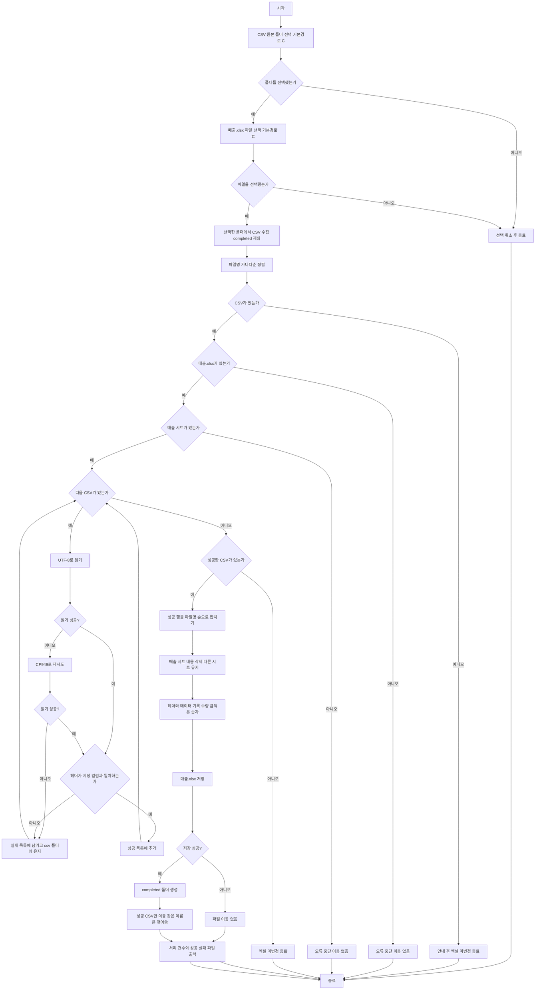

# CSV 매출 이관 플로차트

기준 문서: [A01CSV.md](A01CSV.md)

```mermaid
flowchart TD
    startNode[시작]
    pickCsvDir[CSV 원본 폴더 선택 기본경로 C]
    csvPicked{폴더를 선택했는가}
    pickXlsx[매출.xlsx 파일 선택 기본경로 C]
    xlsxPicked{파일을 선택했는가}
    cancelled[선택 취소 후 종료]
    collectCsv[선택한 폴더에서 CSV 수집 completed 제외]
    sortFiles[파일명 가나다순 정렬]
    hasCsv{CSV가 있는가}
    noCsv[안내 후 엑셀 미변경 종료]
    checkXlsx{매출.xlsx가 있는가}
    missingXlsx[오류 중단 이동 없음]
    checkSheet{매출 시트가 있는가}
    missingSheet[오류 중단 이동 없음]
    nextFile{다음 CSV가 있는가}
    readUtf8[UTF-8로 읽기]
    utf8Ok{읽기 성공?}
    readCp949[CP949로 재시도]
    cp949Ok{읽기 성공?}
    checkHeader{헤더가 지정 컬럼과 일치하는가}
    skipFail[실패 목록에 남기고 csv 폴더에 유지]
    addSuccess[성공 목록에 추가]
    hasSuccess{성공한 CSV가 있는가}
    noSuccess[엑셀 미변경 종료]
    mergeRows[성공 행을 파일명 순으로 합치기]
    clearSheet[매출 시트 내용 삭제 다른 시트 유지]
    writeData[헤더와 데이터 기록 수량 금액은 숫자]
    saveXlsx[매출.xlsx 저장]
    saveOk{저장 성공?}
    saveFail[파일 이동 없음]
    makeCompleted[completed 폴더 생성]
    moveFiles[성공 CSV만 이동 같은 이름은 덮어씀]
    printSummary[처리 건수와 성공 실패 파일 출력]
    endNode[종료]

    startNode --> pickCsvDir --> csvPicked
    csvPicked -->|아니오| cancelled --> endNode
    csvPicked -->|예| pickXlsx --> xlsxPicked
    xlsxPicked -->|아니오| cancelled
    xlsxPicked -->|예| collectCsv --> sortFiles --> hasCsv
    hasCsv -->|아니오| noCsv --> endNode
    hasCsv -->|예| checkXlsx
    checkXlsx -->|아니오| missingXlsx --> endNode
    checkXlsx -->|예| checkSheet
    checkSheet -->|아니오| missingSheet --> endNode
    checkSheet -->|예| nextFile
    nextFile -->|예| readUtf8 --> utf8Ok
    utf8Ok -->|예| checkHeader
    utf8Ok -->|아니오| readCp949 --> cp949Ok
    cp949Ok -->|예| checkHeader
    cp949Ok -->|아니오| skipFail --> nextFile
    checkHeader -->|아니오| skipFail
    checkHeader -->|예| addSuccess --> nextFile
    nextFile -->|아니오| hasSuccess
    hasSuccess -->|아니오| noSuccess --> endNode
    hasSuccess -->|예| mergeRows --> clearSheet --> writeData --> saveXlsx --> saveOk
    saveOk -->|아니오| saveFail --> printSummary --> endNode
    saveOk -->|예| makeCompleted --> moveFiles --> printSummary --> endNode
```
