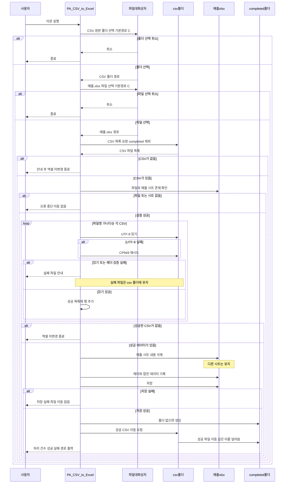

# CSV 매출 이관 시퀀스 차트

기준 문서: [A01CSV.md](A01CSV.md)

```mermaid
sequenceDiagram
    participant User as 사용자
    participant Script as PA_CSV_to_Excel
    participant Dialog as 파일대화상자
    participant CsvDir as csv폴더
    participant Xlsx as 매출xlsx
    participant DoneDir as completed폴더

    User->>Script: 이관 실행
    Script->>Dialog: CSV 원본 폴더 선택 기본경로 C
    alt 폴더 선택 취소
        Dialog-->>Script: 취소
        Script-->>User: 종료
    else 폴더 선택
        Dialog-->>Script: CSV 폴더 경로
        Script->>Dialog: 매출.xlsx 파일 선택 기본경로 C
        alt 파일 선택 취소
            Dialog-->>Script: 취소
            Script-->>User: 종료
        else 파일 선택
            Dialog-->>Script: 매출.xlsx 경로
            Script->>CsvDir: CSV 목록 요청 completed 제외
            CsvDir-->>Script: CSV 파일 목록

            alt CSV가 없음
                Script-->>User: 안내 후 엑셀 미변경 종료
            else CSV가 있음
                Script->>Xlsx: 파일과 매출 시트 존재 확인

                alt 파일 또는 시트 없음
                    Script-->>User: 오류 중단 이동 없음
                else 검증 성공
                    loop 파일명 가나다순 각 CSV
                        Script->>CsvDir: UTF-8 읽기
                        alt UTF-8 실패
                            Script->>CsvDir: CP949 재시도
                        end
                        alt 읽기 또는 헤더 검증 실패
                            Script-->>User: 실패 파일 안내
                            Note over Script,CsvDir: 실패 파일은 csv 폴더에 유지
                        else 읽기 성공
                            Script->>Script: 성공 목록에 행 추가
                        end
                    end

                    alt 성공한 CSV가 없음
                        Script-->>User: 엑셀 미변경 종료
                    else 성공 데이터가 있음
                        Script->>Xlsx: 매출 시트 내용 삭제
                        Note over Xlsx: 다른 시트는 유지
                        Script->>Xlsx: 헤더와 합친 데이터 기록
                        Script->>Xlsx: 저장

                        alt 저장 실패
                            Script-->>User: 저장 실패 파일 이동 없음
                        else 저장 성공
                            Script->>DoneDir: 폴더 없으면 생성
                            Script->>CsvDir: 성공 CSV 이동 요청
                            CsvDir->>DoneDir: 성공 파일 이동 같은 이름 덮어씀
                            Script-->>User: 처리 건수 성공 실패 경로 출력
                        end
                    end
                end
            end
        end
    end
```
