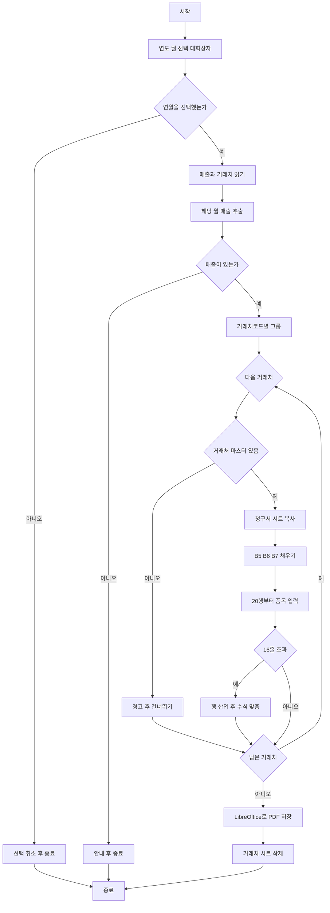

# 거래처별 청구서 발행

지정한 연월(`yyyy-mm`)의 매출을 거래처별로 모아 `청구서.xlsx`의 `청구서` 시트를 복사한 뒤, 시트명과 같은 PDF를 만들고 임시 시트를 삭제하는 Python 프로그램 사양서입니다.

## Notes

- 대상 경로
  - 매출: [resData/매출.xlsx](../resData/매출.xlsx)
  - 청구서 양식: [resData/청구서.xlsx](../resData/청구서.xlsx)
  - PDF 출력: `resData/PDF` (매출.xlsx와 같은 계층, 없으면 생성)
- OS는 Windows. PDF 저장은 LibreOffice(`soffice.exe`)를 사용한다.
- Python은 프로젝트 `.venv`에서 실행한다. 생성한 `.py` 파일은 삭제하지 않는다.
- 실행 파일명은 `PB_Make_Bill.py`이다. 인자가 없으면 연도·월 선택 대화 상자를 연다.
  - 예: `.\.venv\Scripts\python.exe .\PB_Make_Bill.py`
  - 대화 상자를 건너뛰려면 인자를 준다: `.\.venv\Scripts\python.exe .\PB_Make_Bill.py 2025-08`
- 해당 월 매출이 있는 거래처코드만 청구서를 만든다.
- 거래처 시트에 없는 거래처코드는 건너뛰고 경고만 출력한다.
- 품목은 매출일 오름차순으로 20행부터 넣는다.
- 시트명이 겹치면 `_2`, `_3`을 붙인다.
- PDF 출력이 끝나면 거래처별 시트를 삭제하고, 원본 3개 시트만 남긴다.

### 기술 스택

- OS: Windows
- 런타임: 프로젝트 `.venv`의 Python 3
- pandas: 매출·거래처 읽기, `yyyy-mm` 필터, 거래처코드 대조
- openpyxl: `청구서` 시트 복사, 머리글·품목 입력, 16행 초과 시 행 삽입, 수식 복사
- tkinter: 연도·월 선택 대화 상자
- LibreOffice (`soffice.exe`): 시트별 PDF 저장
- 추가 패키지는 `requirements.txt`에 기록한다

### Excel MCP 조사 결과 — 청구서.xlsx

| 시트 | 사용 범위 | 비고 |
| --- | --- | --- |
| 청구서 | A1:I41 | 인쇄용 양식. 이 시트를 복사한다 |
| 청구서 BackUp | A1:I41 | 동일 레이아웃. 건드리지 않는다 |
| 청구서(sample) | A2:I56 | 샘플. 건드리지 않는다 |

청구서 시트 수식

- E17, F17: `=H36` (이번달 매출액)
- G17, H17: `=H37` (소비세)
- I17: `=H36+H37` (이번달 청구액)
- H20~H35: `=F행*G행` (금액 = 수량 × 단가)
- H36: `=SUM(H20:H35)` (과세대상액 10%)
- H37: `=INT(H36*0.1)` (과세대상소비세액, 소수점 버림)

머리글

- B5: 우편번호 (B부터 G까지 병합)
- B6: 주소 (B부터 G까지 병합)
- B7: 거래처명 (B부터 G까지 병합)
- H열: 발행처(주식회사 대박) 고정. 변경하지 않는다

품목 표

- 19행 헤더: 날짜, 상품명, 수량, 단가, 금액, 비고
- 데이터 기본 구간: 20~35행 (16줄)
- 36행 과세대상액, 37행 과세대상소비세액

### Excel MCP 조사 결과 — 매출.xlsx

| 시트 | 사용 범위 | 이 프로그램에서의 사용 |
| --- | --- | --- |
| 매출 | A1:P2443 | 해당 월 데이터 추출 |
| 거래처 | A1:D187 | 우편번호·주소·거래처명 조회 |
| 서울, 광주, 대구, 대전, 부산, 인천 | A1:D32 | 사용하지 않음 |
| 매출01, 거래처01 | 백업 | 사용하지 않음 |

매출 시트 열

- A열: 매출일
- G열: 상품명
- K열: 거래처코드
- M열: 매출수량
- P열: 단가

거래처 시트 열

- A열: 거래처코드
- B열: 거래처명
- C열: 우편번호
- D열: 주소

거래처명이 코드마다 겹칠 수 있다 (예: 청주식당). 시트명은 거래처명을 쓰되, 겹치면 접미사를 붙인다.

## 확정된 요구사항

1. 임의의 연월을 `yyyy-mm` 형태로 지정한다. 실행 시 연도·월 선택 대화 상자로 고른다. 인자를 주면 대화 상자 없이 그 값을 쓴다.
2. `매출.xlsx`의 `매출` 시트에서 해당 연월 데이터만 추출한다.
   1. 매출일자는 A열
   2. 상품명은 G열
   3. 수량은 M열
   4. 단가는 P열
3. `청구서.xlsx`의 `청구서` 시트를 복사하여 거래처별 청구서 시트를 작성한다.
4. 시트명 형식은 `청구처명_YYMM`이다. 청구처명은 거래처 시트의 거래처명을 쓴다. 겹치면 `청구처명_YYMM_2`, `청구처명_YYMM_3`처럼 붙인다.
5. 우편번호, 주소, 거래처명은 `매출.xlsx`의 `거래처` 시트를 이용한다.
   1. 거래처 시트 A열 거래처코드와 매출 시트 K열 거래처코드로 대조한다.
   2. 우편번호는 거래처 시트 C열. 청구서 B5 (B부터 G까지 병합).
   3. 주소는 거래처 시트 D열. 청구서 B6 (B부터 G까지 병합).
   4. 거래처명은 거래처 시트 B열. 청구서 B7 (B부터 G까지 병합).
6. 추출 데이터는 20행 이후에 출력한다. 순서는 매출일 오름차순.
   1. 매출일자는 A열
   2. 상품명은 B열
   3. 수량은 F열
   4. 단가는 G열
7. 원본은 35행까지이므로 16줄을 넘는 데이터는 35행과 36행(과세대상액) 사이에 행을 삽입한다. 삽입한 행의 H열에 `=F행*G행`을 넣고, H36의 `SUM` 범위를 늘어난 품목 행에 맞춘다.
8. 모든 거래처 시트를 만든 뒤, 시트명과 동일한 PDF를 출력한다.
9. PDF 위치는 `매출.xlsx`와 같은 계층의 `PDF` 폴더이다. 없으면 생성한다. 같은 이름이 있으면 덮어쓴다.
10. PDF 출력이 끝나면 거래처별 시트를 삭제한다. `청구서`, `청구서 BackUp`, `청구서(sample)`만 남긴다.

## 예외·경계

- 대화 상자에서 취소를 누르면 엑셀을 변경하지 않고 종료한다.
- 인자가 있는데 `yyyy-mm` 형식이 아니면 오류로 종료한다.
- 매출.xlsx, 청구서.xlsx, `매출`/`거래처`/`청구서` 시트가 없으면 오류로 중단한다.
- 해당 월 매출이 없으면 엑셀을 변경하지 않고 안내 후 종료한다.
- 매출의 거래처코드가 거래처 시트에 없으면 그 거래처는 건너뛰고 경고한다.
- 엑셀 시트명에 쓸 수 없는 문자(`\ / * ? : [ ]`)는 제거하거나 대체한다. 시트명 길이는 31자를 넘지 않게 한다.
- 수량·단가는 숫자로 넣는다. 금액(H열)은 값 대신 기존 수식을 유지·복사한다.
- PDF 저장에는 LibreOffice가 필요하다. 변환에 실패하면 거래처 시트를 남기지 않고 오류로 중단한다.
- 콘솔에 대상 연월, 작성 시트 수, 건너뛴 거래처, PDF 경로를 출력한다.

# Tasks

- [ ] 1.0 실행 환경 준비
  - [ ] 1.1 프로젝트 루트에 `.venv`가 없으면 생성한다
  - [ ] 1.2 `.venv`에 pandas, openpyxl, pywin32를 설치한다
  - [ ] 1.3 의존성을 `requirements.txt`에 기록한다
- [x] 2.0 연월 지정
  - [x] 2.1 인자가 없으면 연도·월 선택 대화 상자를 연다
  - [x] 2.2 취소를 누르면 종료한다
  - [x] 2.3 인자가 있으면 `yyyy-mm`으로 해석한다
  - [x] 2.4 형식이 아니면 오류로 종료한다
- [ ] 3.0 엑셀 파일·시트 검증
  - [ ] 3.1 `resData/매출.xlsx`와 `매출`, `거래처` 시트 존재를 확인한다
  - [ ] 3.2 `resData/청구서.xlsx`와 `청구서` 시트 존재를 확인한다
  - [ ] 3.3 없으면 오류로 중단한다
- [ ] 4.0 해당 월 매출 추출
  - [ ] 4.1 매출 시트에서 매출일(A)이 지정 연월인 행만 고른다
  - [ ] 4.2 상품명(G), 수량(M), 단가(P), 거래처코드(K)를 가져온다
  - [ ] 4.3 해당 월 데이터가 없으면 안내 후 엑셀을 변경하지 않고 종료한다
- [ ] 5.0 거래처 대조
  - [ ] 5.1 매출 거래처코드와 거래처 시트 A열을 대조한다
  - [ ] 5.2 마스터가 있으면 우편번호(C), 주소(D), 거래처명(B)을 읽는다
  - [ ] 5.3 마스터가 없으면 경고하고 그 거래처는 건너뛴다
- [ ] 6.0 거래처별 청구서 시트 작성
  - [ ] 6.1 `청구서` 시트를 복사한다. 다른 원본 시트는 건드리지 않는다
  - [ ] 6.2 시트명을 `거래처명_YYMM`으로 한다. 겹치면 `_2`, `_3`을 붙인다
  - [ ] 6.3 B5에 우편번호, B6에 주소, B7에 거래처명을 넣는다
  - [ ] 6.4 품목을 매출일 오름차순으로 20행부터 넣는다 (A 매출일, B 상품명, F 수량, G 단가)
  - [ ] 6.5 16줄을 넘으면 35행과 36행 사이에 행을 삽입한다
  - [ ] 6.6 삽입 행 H열에 `=F행*G행`을 넣고, H36의 SUM 범위를 품목 행에 맞춘다
- [ ] 7.0 PDF 출력
  - [ ] 7.1 `resData/PDF` 폴더가 없으면 생성한다
  - [x] 7.2 LibreOffice로 각 거래처 시트를 시트명.pdf로 저장한다
  - [ ] 7.3 같은 이름이 있으면 덮어쓴다
- [ ] 8.0 임시 시트 삭제
  - [ ] 8.1 PDF가 끝난 뒤 거래처별 시트를 삭제한다
  - [ ] 8.2 `청구서`, `청구서 BackUp`, `청구서(sample)`만 남긴다
  - [ ] 8.3 PDF 저장에 실패하면 거래처 시트를 남기지 않고 오류를 안내한다
- [ ] 9.0 실행 스크립트와 결과 안내
  - [x] 9.1 프로젝트 루트에 `PB_Make_Bill.py`를 작성한다
  - [ ] 9.2 대상 연월, 작성 시트 수, 건너뛴 거래처, PDF 경로를 콘솔에 출력한다
