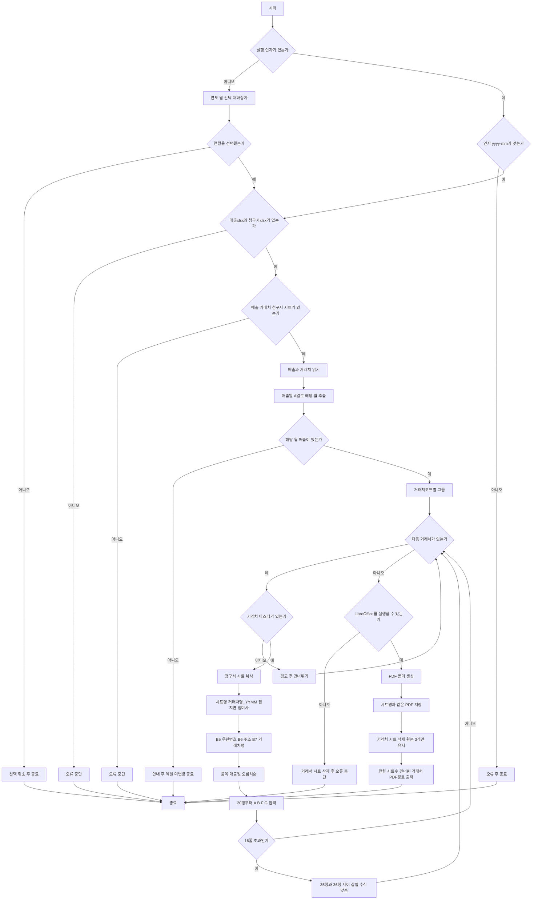

# 청구서 발행 플로차트

기준 문서: [B01Bill.md](B01Bill.md)

```mermaid
flowchart TD
    startNode[시작]
    hasArg{실행 인자가 있는가}
    parseArg{인자 yyyy-mm가 맞는가}
    badArg[오류 후 종료]
    pickYm[연도 월 선택 대화상자]
    ymPicked{연월을 선택했는가}
    cancelled[선택 취소 후 종료]
    checkFiles{매출xlsx와 청구서xlsx가 있는가}
    missingFile[오류 중단]
    checkSheets{매출 거래처 청구서 시트가 있는가}
    missingSheet[오류 중단]
    loadData[매출과 거래처 읽기]
    filterMonth[매출일 A열로 해당 월 추출]
    hasSales{해당 월 매출이 있는가}
    noSales[안내 후 엑셀 미변경 종료]
    groupCust[거래처코드별 그룹]
    nextCust{다음 거래처가 있는가}
    lookupMaster{거래처 마스터가 있는가}
    skipWarn[경고 후 건너뛰기]
    copySheet[청구서 시트 복사]
    nameSheet[시트명 거래처명_YYMM 겹치면 접미사]
    fillHeader[B5 우편번호 B6 주소 B7 거래처명]
    sortItems[품목 매출일 오름차순]
    fillItems[20행부터 A B F G 입력]
    needRows{16줄 초과인가}
    insertRows[35행과 36행 사이 삽입 수식 맞춤]
    loOk{LibreOffice를 실행할 수 있는가}
    loFail[거래처 시트 삭제 후 오류 중단]
    makePdfDir[PDF 폴더 생성]
    exportPdf[시트명과 같은 PDF 저장]
    deleteSheets[거래처 시트 삭제 원본 3개만 유지]
    printSummary[연월 시트수 건너뛴 거래처 PDF경로 출력]
    endNode[종료]

    startNode --> hasArg
    hasArg -->|아니오| pickYm --> ymPicked
    ymPicked -->|아니오| cancelled --> endNode
    ymPicked -->|예| checkFiles
    hasArg -->|예| parseArg
    parseArg -->|아니오| badArg --> endNode
    parseArg -->|예| checkFiles
    checkFiles -->|아니오| missingFile --> endNode
    checkFiles -->|예| checkSheets
    checkSheets -->|아니오| missingSheet --> endNode
    checkSheets -->|예| loadData --> filterMonth --> hasSales
    hasSales -->|아니오| noSales --> endNode
    hasSales -->|예| groupCust --> nextCust
    nextCust -->|예| lookupMaster
    lookupMaster -->|아니오| skipWarn --> nextCust
    lookupMaster -->|예| copySheet --> nameSheet --> fillHeader --> sortItems --> fillItems --> needRows
    needRows -->|예| insertRows --> nextCust
    needRows -->|아니오| nextCust
    nextCust -->|아니오| loOk
    loOk -->|아니오| loFail --> endNode
    loOk -->|예| makePdfDir --> exportPdf --> deleteSheets --> printSummary --> endNode
```
