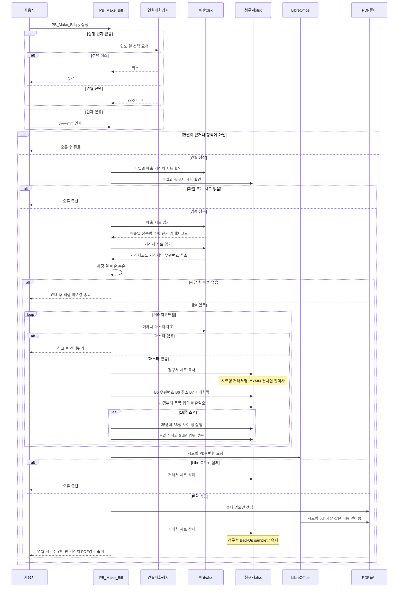

# 청구서 발행 시퀀스 차트

기준 문서: [B01Bill.md](B01Bill.md)

```mermaid
sequenceDiagram
    participant User as 사용자
    participant Script as PB_Make_Bill
    participant Dialog as 연월대화상자
    participant Sales as 매출xlsx
    participant Bill as 청구서xlsx
    participant Libre as LibreOffice
    participant PdfDir as PDF폴더

    User->>Script: PB_Make_Bill.py 실행

    alt 실행 인자 없음
        Script->>Dialog: 연도 월 선택 요청
        alt 선택 취소
            Dialog-->>Script: 취소
            Script-->>User: 종료
        else 연월 선택
            Dialog-->>Script: yyyy-mm
        end
    else 인자 있음
        User->>Script: yyyy-mm 인자
    end

    alt 연월이 없거나 형식이 아님
        Script-->>User: 오류 후 종료
    else 연월 정상
        Script->>Sales: 파일과 매출 거래처 시트 확인
        Script->>Bill: 파일과 청구서 시트 확인

        alt 파일 또는 시트 없음
            Script-->>User: 오류 중단
        else 검증 성공
            Script->>Sales: 매출 시트 읽기
            Sales-->>Script: 매출일 상품명 수량 단가 거래처코드
            Script->>Sales: 거래처 시트 읽기
            Sales-->>Script: 거래처코드 거래처명 우편번호 주소
            Script->>Script: 해당 월 매출 추출

            alt 해당 월 매출 없음
                Script-->>User: 안내 후 엑셀 미변경 종료
            else 매출 있음
                loop 거래처코드별
                    Script->>Sales: 거래처 마스터 대조

                    alt 마스터 없음
                        Script-->>User: 경고 후 건너뛰기
                    else 마스터 있음
                        Script->>Bill: 청구서 시트 복사
                        Note over Bill: 시트명 거래처명_YYMM 겹치면 접미사
                        Script->>Bill: B5 우편번호 B6 주소 B7 거래처명
                        Script->>Bill: 20행부터 품목 입력 매출일순
                        alt 16줄 초과
                            Script->>Bill: 35행과 36행 사이 행 삽입
                            Script->>Bill: H열 수식과 SUM 범위 맞춤
                        end
                    end
                end

                Script->>Libre: 시트별 PDF 변환 요청
                alt LibreOffice 실패
                    Script->>Bill: 거래처 시트 삭제
                    Script-->>User: 오류 중단
                else 변환 성공
                    Script->>PdfDir: 폴더 없으면 생성
                    Libre->>PdfDir: 시트명.pdf 저장 같은 이름 덮어씀
                    Script->>Bill: 거래처 시트 삭제
                    Note over Bill: 청구서 BackUp sample만 유지
                    Script-->>User: 연월 시트수 건너뛴 거래처 PDF경로 출력
                end
            end
        end
    end
```
